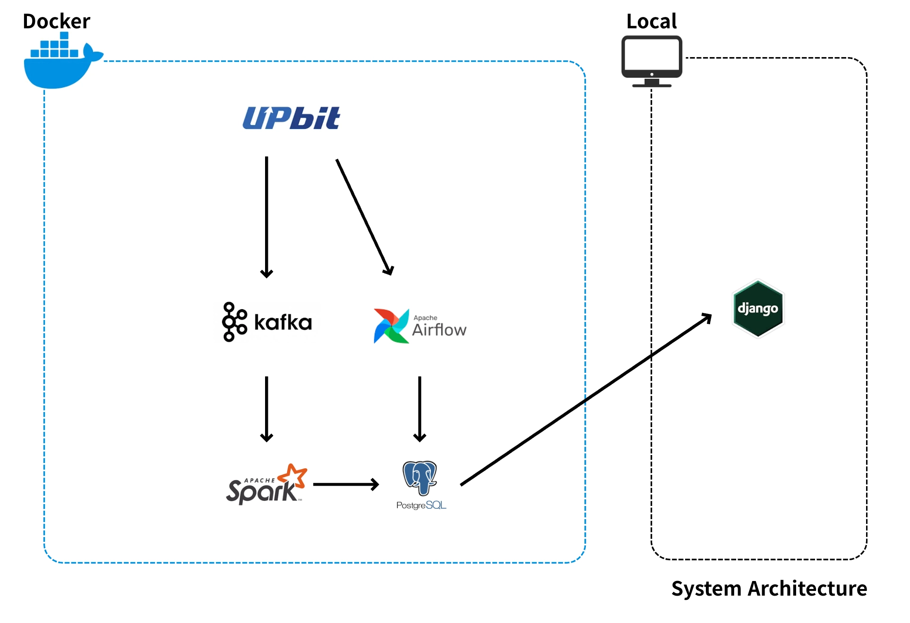

# Sentinel-Fi

> Kafka와 Flink 기반 실시간 암호화폐 시세 처리 및 이상 변동 탐지 파이프라인

Sentinel-Fi는 Upbit WebSocket에서 발생하는 실시간 암호화폐 ticker 데이터를 Kafka로 수집하고, Apache Flink에서 실시간 집계 및 이상 변동 탐지를 수행한 뒤 PostgreSQL에 저장하는 데이터 엔지니어링 프로젝트입니다.

초기에는 금융 데이터 기반 웹 서비스로 기획했지만, 현재는 실시간 데이터 수집, 스트림 처리, 지연 시간 측정, 데이터 품질 검증, 성능 실험을 중심으로 프로젝트 범위를 재정의했습니다.

---

## 1. Overview

이 프로젝트의 목표는 실시간 금융 데이터를 안정적으로 수집하고, 처리 과정에서 발생하는 지연과 병목을 정량적으로 관찰할 수 있는 스트리밍 파이프라인을 구축하는 것입니다.

핵심 목표는 다음과 같습니다.

- Upbit WebSocket 기반 실시간 ticker 데이터 수집
- Kafka를 통한 수집 계층과 처리 계층 분리
- Flink 기반 1초 단위 처리량, 지연 시간, 오류율 집계
- Flink Event Time Window 기반 급등락 탐지
- PostgreSQL에 원천 데이터, 이상 데이터, 집계 결과 저장
- Airflow를 통한 마켓 코드 동기화 자동화
- Django API를 통한 실시간 메트릭 조회

---

## 2. Architecture



### 주요 데이터 흐름

```text
Upbit WebSocket
    ↓
Kafka Producer
    ↓
Kafka Topic: ticker
    ├── Flink Metric Job
    │       └── flink_realtime_metric
    │
    ├── Flink Drop Detection Job
    │       └── window_stats
    │
    └── Django Kafka Consumer
            ├── ticker_date
            └── bad_ticker_date

Airflow DAG
    └── market table sync
```
### 핵심 테이블

|테이블	                  |                         역할|
|-----------------------|----------------------------|
|market                 |	Upbit 지원 마켓 목록 관리|
|ticker_date           |	정상 ticker 원천 데이터 저장|
|bad_ticker_date	      |비정상 ticker 데이터와 오류 사유 저장|
|window_stats          |	Flink 급등락 탐지 결과 저장|
|flink_realtime_metric	|1초 단위 처리량, 지연 시간, 오류율 저장|
|flink_market_metric    |	마켓별 처리량, 지연 시간, 오류율 저장|

---
## 3. Tech Stack
| 영역  |   기슬    | 사용 목적 |
|------|---------|----------|
|Data Source| Upbit Websocket | 실시간 암호화폐 ticker 데이터 수집|
|Message Broker| Kafka | 수집 속도와 처리 속도 분리, 메세지 버퍼링 |
|Stream Processing| Apache Flink| 실시간 윈도우 집계, 지연 시간 측정, 급등락 탐지|
|DataBase| PostgrSQL | 원천 데이터, 집계 결과, 이상 데이터 저장|
|Scheduler| Airflow| 마켓 코드 동기화 등 주기 작업 관리|
|Backend| Django| 데이터 모델링 및 메트릭 조회 API|
|Infra| Docker | Kafka, Flink, PostgreSQL, Airflow 로컬 실행 환경 구성|

---
## 4. Core Features.
### 4.1 실시간 데이터 수집
Upbit WebSocket을 통해 여러 암호화폐 마켓의 ticker 데이터를 실시간으로 구독합니다. 수신한 데이터는 Kafka `ticker` 토픽으로 전송되며, 이후 Flink Job과 Django Consumer가
독립적으로 소비합니다.


Kafka를 중간 버러포 사용함으로써 데이터 수집 계층과 처리 계층을 분리했습니다. 이를 통해 처리 계층이 일시적으로 느려져도 Producer는 Kafka에 메세지를 계속 적재할 수 있습니다.

관련 파일:
- `backend-pjt/collector/upbit_ws.py`
- `backend-pjt/collector/kafka_consumer.py`

---

### 4.2 Flink 1초 단위 실시간 메트릭 집계
Flink Metric Job은 Kafka `ticker` 토픽에서 메세지를 읽고, 1초 Tumbling Window 단위로 파이프라인 운영 지표를 계산합니다.

집계 항목
- 초당 수집 데이터 수
- 오류 데이터 수
- 오류율
- 평규 ㄴ지연 시간
- 최대 지연 시간
- 활성 마켓 수
- 초당 총 거래대금

관련 파일
- `pipeline/jobs/metric_collections.py`
- `backend-pjt/flink_metrics/models.py`
---

### 4.4 Flink 슬라이딩 윈도우 기반 급등락 탐지
Drop Detection Job은 마켓별로 데이터를 그룹화한 뒤, 5분 크기의 Sliding Event Time Window에서 시작가와 종가를 비교합니다. 이를 통해 특정 시간 구간의 가격 변화율과 상태를 저장합니다.

급등락 기준은 테스트 목적에 맞게 임의로 설정했습니다.

관련 파일
- `pipeline/jobs/drop_detect.py`
- `pipeline/jobs/utils/metrics.py`
- `pipeline/jobs/utils/watermark.py`
- `backend-pjt/window_stats/models.py`
---

### 4.5 Airflow 기반 마켓 코드 동기화
Upbit에서 지원하는 마켓 목록은 시간이 지나며 변경될 수 있습니다. Sentinel-Fi는 Airflow DAG를 사용해 Upbit Market API를 주기적으로 호출하고, PostgreSQL `market` 테이블과 비교해 신규 상장 및 비활성화 마켓을 반영합니다.

Airflow는 초 단위 실시간 처리에는 적합하지 않기 때문에, 실시간 스트림 처리는 Flink가 담당하고 Airflow는 주기적 운영 작업을 담당하도록 역할을 분리했습니다.

관련 파일:
- `pipeline/dags/fetch_coins.py`
- `pipeline/dags/utils.py`
- `backend-pjt/collector/sync_markets.py`

---

### 4.6 데이터 품질 검증
Kafka Consumer는 ticker 데이터를 저장하기 전 필수 필드 누락, 음수 값, 잘못된 범주형 값 등을 검증합니다.


정상 데이터는 ticker_date에 저장하고, 비정상 데이터는 원본 payload와 오류 사유를 함께 bad_ticker_date에 저장합니다. 이를 통해 데이터 품질 문제가 발생했을 때 어떤 데이터가 어떤 이유로 제외되었는지 추적할 수 있습니다.


검증 조건:
- `code`, `trade_price`, `timestamp` 필수 필드 존재 여부
- `trade_price`, `trade_volume` 음수 여부
- `change` 값이 RISE, EVEN, FALL 중 하나인지 확인
- `stream_type` 값이 SNAPSHOT, REALTIME 중 하나인지 확인

관련 파일:
- `backend-pjt/collector/kafka_consumer.py`
- `backend-pjt/market_data/models.py`

---
## 5. Metrics

Sentinel-Fi는 단순히 데이터를 저장하는 것에서 끝나지 않고, 파이프라인 상태를 숫자로 관찰할 수 있도록 별도 메트릭을 저장합니다.

| 지표 | 설명 | 저장 위치 |
| --- | --- | --- |
| **초당 처리량** | 1초 동안 Flink가 소비한 ticker 메시지 수 | `flink_realtime_metric.total_collected_count` |
| **평균 지연 시간** | 메시지 timestamp와 처리 시각의 평균 차이 | `flink_realtime_metric.average_latency_ms` |
| **최대 지연 시간** | 1초 윈도우 내 가장 큰 지연 시간 | `flink_realtime_metric.max_latency_ms` |
| **오류율** | 전체 메시지 중 비정상 메시지 비율 | `flink_realtime_metric.error_rate_percentage` |
| **활성 마켓 수** | 1초 동안 수신된 고유 마켓 수 | `flink_realtime_metric.unique_market_count` |
| **초당 거래대금** | 1초 동안 처리된 거래대금 합계 | `flink_realtime_metric.total_trade_volume_krw` |
| **윈도우별 변동률** | 5분 윈도우 시작가/종가 기준 변동률 | `window_stats.change_rate` |

---
## 6.Performance Experiment
### 6.1 실험 목적
Flink 기반 실시간 처리 파이프라인에서 처리량과 지연 시간에 영향을 주는 요소를 확인하기 위해 성능 실험을 수행했습니다.

측정 지표:
- 평균 처리량
- 최대 처리량
- 평균 지연 시간
- p95 지연 시간
- 최대 지연 시간
- 오류율
---

### 6.2 실험 결과
| 실험 조건 | 샘플 수 | 평균 처리량 | 최대 처리량 | 평균 지연 | p95 지연 | 최대 지연 | 오류율 |
| :--- | :---: | :---: | :---: | :---: | :---: | :---: | :---: |
| 기본 설정 | 360초 | 54.95 events/s | 137 events/s | 1077.15ms | 1713.56ms | 2241.20ms | 0.00% |
| parallelism=2 | 296초 | 65.91 events/s | 255 events/s | 1341.98ms | 2431.94ms | 2431.73ms | 0.00% |
| parallelism=4 | 296초 | 55.40 events/s | 212 events/s | 1056.52ms | 1299.40ms | 2350.82ms | 0.00% |
| print 제거 + DB flush 조정 | 394초 | 746.20 events/s | 1500 events/s | 346.13ms | 623.23ms | 1217.02ms | 0.00% |

---

### 6.3 실험 해성
기본 설정에서는 실제 Upbit ticker 스트림 기준으로 평균 54.95 events/s를 처리했고, 평균 지연 시간은 1077.15ms로 측정되었습니다.

Flink parallelism을 2로 증가시켰을 때 평균 처리량은 증가했지만 평균 지연과 p95 지연도 함께 증가했습니다. parallelism을 4로 증가시켰을 때는 p95 지연은 개선되었지만 평균 처리량은 기본 설정과 큰 차이를 보이지 않았습니다.

이를 통해 단순히 parallelism 값을 높이는 것만으로는 처리 성능이 선형적으로 개선되지 않으며, Kafka 입력량, partition 수, window 집계 방식, DB sink 처리 방식 등 전체 파이프라인 병목을 함께 고려해야 함을 확인했습니다.

추가로 synthetic producer를 이용해 고정 부하를 생성하고, 디버깅용 print() sink 제거 및 JDBC Sink flush 조건을 조정했습니다. 그 결과 평균 지연 시간과 최대 지연 시간이 감소했으며, 스트리밍 파이프라인에서는 연산 로직뿐 아니라 로그 I/O와 sink flush 조건도 latency에 영향을 줄 수 있음을 확인했습니다.

---

### 6.4 성능 실험의 한계
이번 실험은 Flink Job 설정 변경, synthetic producer 실행, SQL 집계를 수동으로 수행했습니다. 이 방식은 반복 실험 시 조건 관리와 결과 기록의 일관성이 떨어질 수 있습니다.

향후에는 benchmark runner를 작성해 실험 조건 설정, 메트릭 테이블 초기화, synthetic producer 실행, 결과 쿼리, Markdown/CSV 저장을 자동화할 계획입니다. 

또한 Prometheus/Grafana를 도입해 Flink backpressure, Kafka consumer lag, PostgreSQL query latency까지 함께 관찰할 수 있도록 확장할 예정입니다.

---

## 7. Troubleshooting
### 7.1 PyFlink 커스텀 모듈 수정 사항 미반영
**문제**
Flink Job 스크립트를 수정해도 내부에서 import하는 utils 모듈의 변경 사항이 반영되지 않았습니다.

**원인**
PyFlink는 내부적으로 Beam Worker를 실행하며, 메인 스크립트 경로와 별개로 Python import 경로를 탐색합니다. 기존 Dockerfile에서는 utils 모듈을 빌드 시점에 site-packages로 복사했기 때문에, 로컬 수정 사항이 컨테이너 내부에 반영되지 않았습니다.

**해결**
로컬 pipeline/jobs/utils 디렉토리를 컨테이너의 site-packages/utils 경로에 직접 볼륨 마운트했습니다.
```YAML
volumes:
  - ./pipeline/jobs:/opt/flink/pipeline
  - ./pipeline/jobs/utils:/usr/local/lib/python3.10/dist-packages/utils
```
---
### 7.2 TaskManger 미등록으로 인한 Job 제출 실패
**문제**
Flink Job 제출 시 NoResourceAvailableException이 발생했고, Flink Dashboard에서 Available Task Slots가 0으로 표시되었습니다.

**원인**
TaskManager가 JobManager에 등록되지 못해 실제 연산을 수행할 Task Slot이 없는 상태였습니다. Docker Compose 환경에서 JobManager 주소 설정이 누락되어 TaskManager가 잘못된 주소로 연결을 시도했습니다.

**해결**
TaskManager 환경 변수에 JobManager RPC 주소를 명시했습니다.

```YAML
environment:
  - JOB_MANAGER_RPC_ADDRESS=jobmanager
  ```
---

8. How to Run
### 8.1 인프라 실행
```bash
docker compose up -d
```
### 8.2 Django 마이그레이션
```bash
cd backend-pjt
python manage.py migrate
```
### 8.3 Upbit WebSocket Producer 실행
``` bash
python backend-pjt/collector/upbit_ws.py
```
### 8.4 Kafka Consumer 실행
``` bash
python backend-pjt/collector/kafka_consumer.py
```
### 8.5 Flink Job 실행
``` bash
docker exec -it sentinel_fi_flink_jobmanager flink run -py /opt/flink/pipeline/drop_detect.py
docker exec -it sentinel_fi_flink_jobmanager flink run -py /opt/flink/pipeline/metric_collections.py
docker exec -it sentinel_fi_flink_jobmanager flink run -py /opt/flink/pipeline/market_metric_collections.py
```
### 8.6 Synthetic Producer 실행
``` bash
python backend-pjt/collector/synthetic_ticker_producer.py --rate 1000 --duration 600 --bad-rate 0.0
```
---
## 9. Future Work
- Kafka consumer lag 측정 지표 추가
- benchmark runner를 통한 성능 실험 자동화
- Prometheus/Grafana 기반 모니터링 대시보드 구성
- Kafka partition 수와 Flink parallelism 조합 실험
- PostgreSQL 인덱스 및 batch insert 전략 최적화
- 특정 마켓 데이터 공백 감지 기능 추가
- TimescaleDB 또는 파티셔닝을 통한 시계열 데이터 저장 최적화